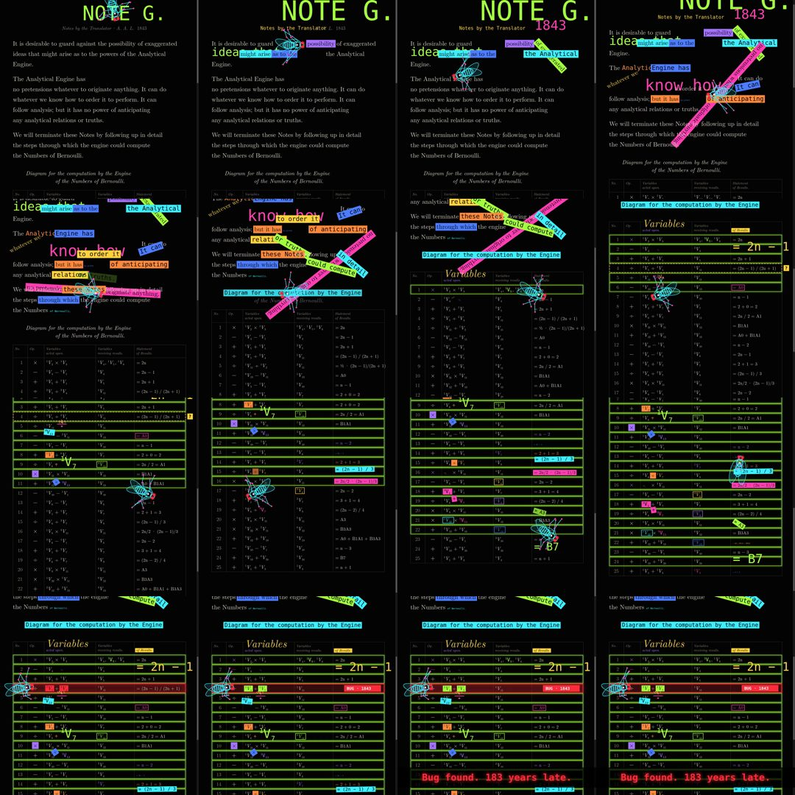

# Fly on Note G



A fruit fly walks across Ada Lovelace's Note G (1843), the table often called the first computer program.
Words light up as its feet land on them, some lift off the page, and the fly ends on operation 4,
the row where the published table has an error.

## Files

- `anim.html` — the whole scene on one canvas: page layout, the fly (line drawing with jointed legs), effects
- `rend.py` — renders stills or the full video frame by frame with Playwright
- `ev.py` — exports the event log (every word the fly touches, with a timestamp)
- `music.py` — synthesizes the score from that log, no samples

## Run

```bash
pip install playwright numpy scipy soundfile && playwright install chromium
python3 rend.py video 60 frames 15.8      # 60 fps, 15.8 s
python3 ev.py && python3 music.py         # events.json, then music.wav
ffmpeg -framerate 60 -i frames/f%04d.png -i music.wav -c:v libx264 -pix_fmt yuv420p -c:a aac -shortest note_g.mp4
```

Fonts: Latin Modern (TeX Live `lmodern`), DejaVu Sans Mono and Poppins must be installed.
