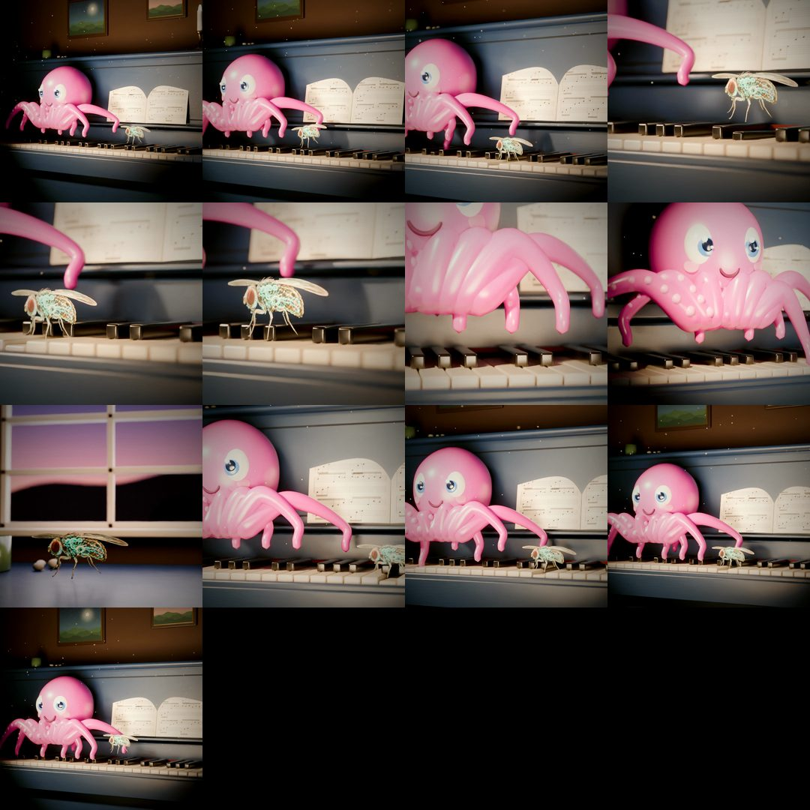

# Fly plays Für Elise



A fruit fly on a grand piano, keys moving to Für Elise. Rendered in Blender Cycles from a Python script,
no hand animation.

## Files

- `scene.py` — builds the whole scene in Blender (piano, keys driven by `score.json`, fly, room, camera) and renders frames
- `textures.py` — generates the painted textures in `tex/`
- `score.json` — the notes and timings the keys follow
- `audio.py` — renders `fur_elise_own.wav` from the score with the Salamander Grand Piano samples
- `post.sh` — upscale, glow, grade and mux with ffmpeg

## Run

```bash
pip install bpy numpy pillow scipy soundfile
python3 textures.py
python3 scene.py -- full $(seq -s, 0 467) 640 12   # out dir, frame list, resolution, samples per pixel
# download Salamander Grand Piano (CC BY 3.0, Alexander Holm) into ./samples
python3 audio.py
./post.sh fur_elise.mp4
```

Piano samples: Salamander Grand Piano by Alexander Holm, CC BY 3.0.
