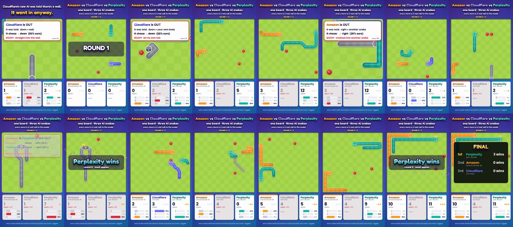

# Snake arena



Three decision models play Snake on one 14×14 board, 3 rounds:

- Amazon Strands Decider 2B
- Cloudflare Clef-flash
- Perplexity pplx-decider

Every tick each model gets its own situation in words and picks a move. All calls run in parallel,
then all snakes move at once. Every call is logged with the full raw answer and latency, and the video
is rebuilt from the log.

## Two runs, one change

| | Options the model sees |
|---|---|
| Run 1 (`snake_arena.py`) | `move up`, `move down`, `move right` |
| Run 2 (`snake_arena_v2.py`) | `move right: wall is there, the snake dies` |

The board, the rules and the models are the same. Only the option text changes.

Average probability each model put on the deadly option:

| Model | Run 1 | Run 2 |
|---|---|---|
| Perplexity pplx-decider | 2.2% | 1.7% |
| Amazon Strands Decider 2B | 37.0% | 11.9% |
| Cloudflare Clef-flash | 40.8% | 37.2% |

Perplexity won all 3 rounds in both runs. Logs: `logs/`.
One run per setup, so treat this as an experiment, not a benchmark.

## Run

```bash
export STRANDS_URL=...      # local strands-decider server
export CF_ACCOUNT_ID=... CF_API_TOKEN=...
export PPLX_KEY=... PPLX_URL=...
python3 snake_arena_v2.py   # writes snake_arena_v2_log.json
```

Keys are read from environment variables only. Never commit them.

## Render the video

```bash
cd render
npm pack @fontsource/fredoka && mkdir -p fonts && tar xzf fontsource-fredoka-*.tgz -C fonts
./make.sh ../logs/run2_consequence_in_options.json arena.mp4
```
