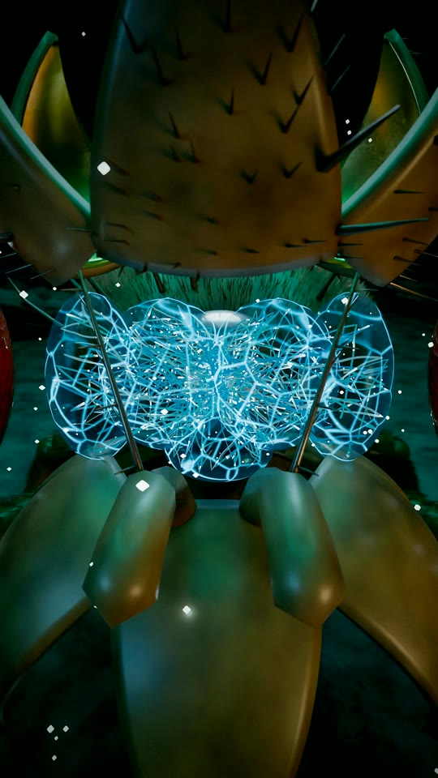

# 04 · Fly under the UFO



A giant fruit fly stands in the beam of a saucer in a night desert. The camera pushes into its head, the head capsule opens like petals, a new brain lights up inside, then everything closes and the eyes flare.

No video model and no 3D artist. Every frame is drawn by Blender / Cycles from this script, and the score is synthesised with numpy.

What the code builds:

- the desert, rocks, night sky and clouds
- the saucer with its teal beam
- the fly: compound eyes, a head capsule split into panels that open, antennae, wings, fur on the thorax and abdomen, segmented legs with five tarsal segments and claws
- the brain: a glowing vein network and neurons that pulse
- the camera move and every light
- the sound: wind, saucer hum, servos, the brain crackle, the final sting

## Files

- `scene.py` builds and renders the scene (`BUBO_GPU=1` uses OptiX/CUDA when present)
- `audio.py` writes `ufo.wav`
- `post.sh` turns frames + audio into a 1080×1920 mp4
- `colab_render.sh` runs the whole pipeline on a Colab GPU
- `wing.png` the wing vein texture, generated by `scene.py` if missing

## Run

```bash
pip install bpy numpy pillow scipy soundfile
python3 scene.py -- full 0:672:1 1080 24 frames   # out dir, frames, width, samples per pixel
python3 audio.py
./post.sh fly_ufo.mp4
```

28 seconds, 672 frames.
