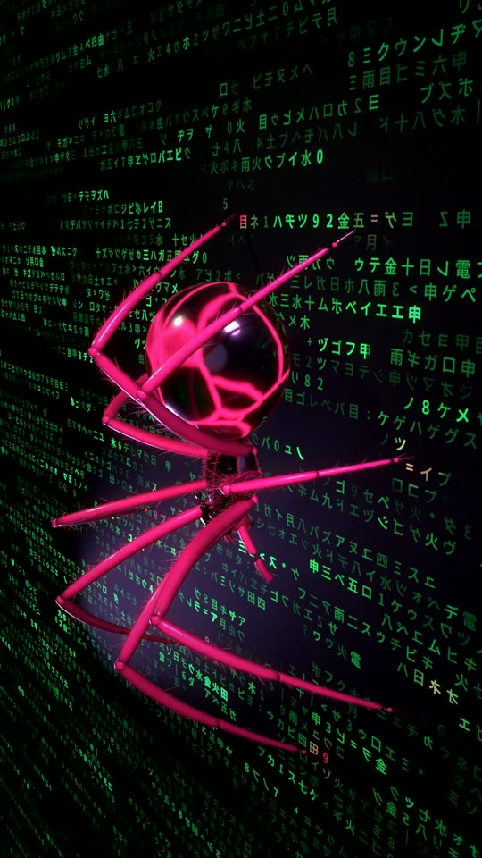

# 05 · Code scanner



A raspberry spider crawls down a wall of moving code. Its feet spark on the characters, the code around it turns red, then it looks into the lens and jumps.

Everything is built by the script in Blender / Cycles: the spider (shaped leg segments, bristles as particle hair, glossy abdomen with a glowing crack pattern), the walk cycle with inverse kinematics, the code wall, the camera and the lights. The score is synthesised with numpy, no samples.

## Files

- `spider.py` builds the scene and renders frames (`BUBO_GPU=1` uses OptiX/CUDA)
- `glyphs.py` draws the character atlas `glyphs.png` for the code wall
- `audio.py` writes `spider.wav`, timed to the footsteps
- `post.sh` turns frames + audio into a 1080×1920 mp4 with bloom and grain
- `colab_render.sh` runs the whole pipeline on a Colab GPU

## Run

```bash
pip install bpy numpy pillow scipy soundfile
python3 glyphs.py
python3 spider.py -- full 0:336:1 720 20 frames   # out dir, frames, width, samples per pixel
python3 audio.py
./post.sh spider.mp4
```

Characters are drawn with Noto Sans CJK (SIL Open Font License).
