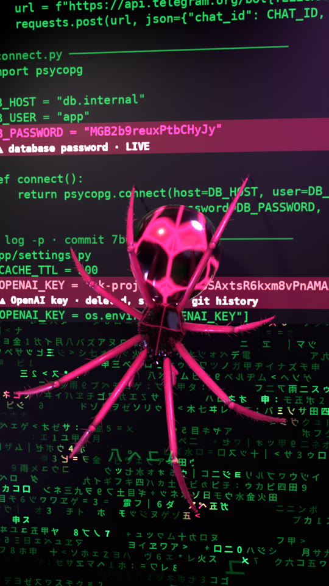

# 07 · keyspider film



The spider from build 05 walks down real code and the lines it reaches turn red: those are the secrets [keyspider](../06-keyspider) found in that code. Three are live in the files, one was deleted but is still in the git history. The film ends on the scan result.

The code is a small demo project with random fake keys. `codeatlas.py` builds it as a real git repo (one key committed and then removed), runs keyspider on it, and draws the listing the spider walks on, marking exactly the rows keyspider reported.

## Files

- `codeatlas.py` builds the demo repo, scans it, writes `panel.png` and `panel.json`
- `film.py` the Blender scene (spider, code wall, camera), lights each found line when the spider reaches it
- `audio.py` writes `film.wav`, with a hit on every find
- `card.py` the scan-result end card
- `post.sh` frames + audio + card into a 1080×1920 mp4
- `colab_render.sh` the whole pipeline on a Colab GPU

## Run

```bash
pip install bpy numpy pillow scipy soundfile
python3 codeatlas.py && python3 audio.py && python3 card.py
python3 film.py -- full 0:336:1 720 20 frames
./post.sh keyspider_film.mp4
```

Every key in the demo project is random and fake.
